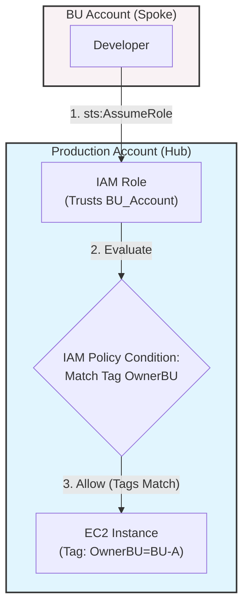
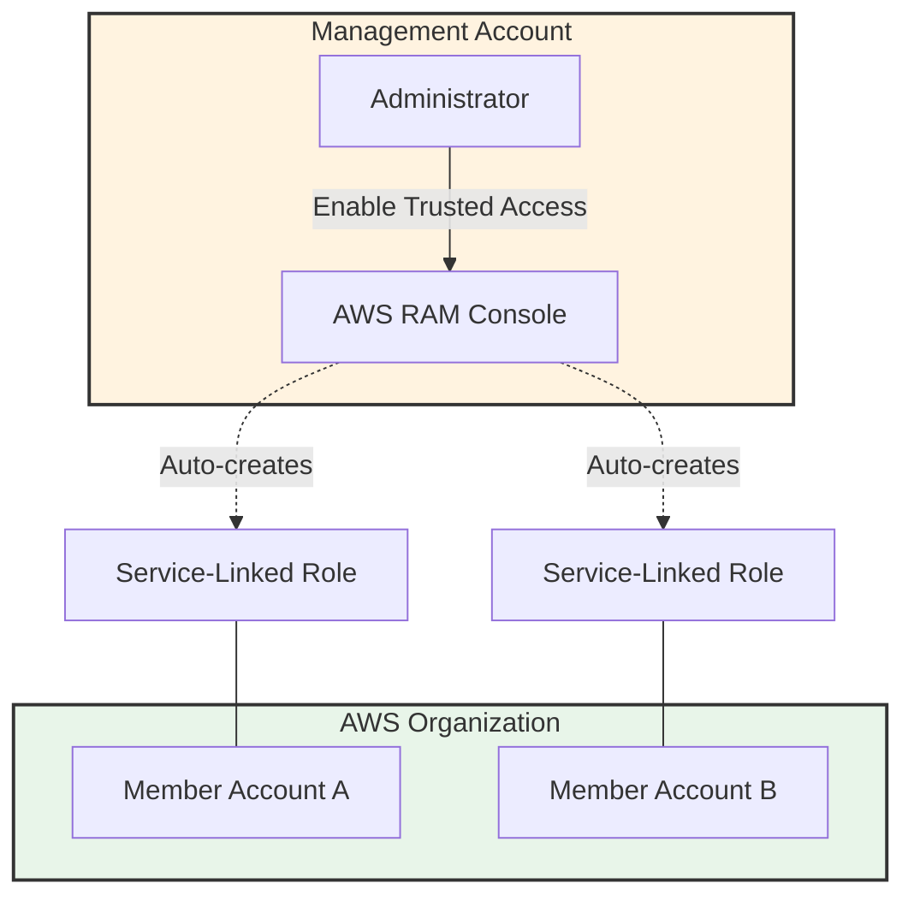
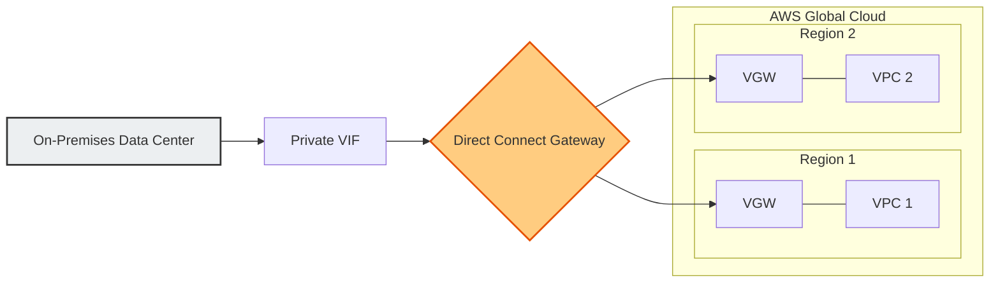
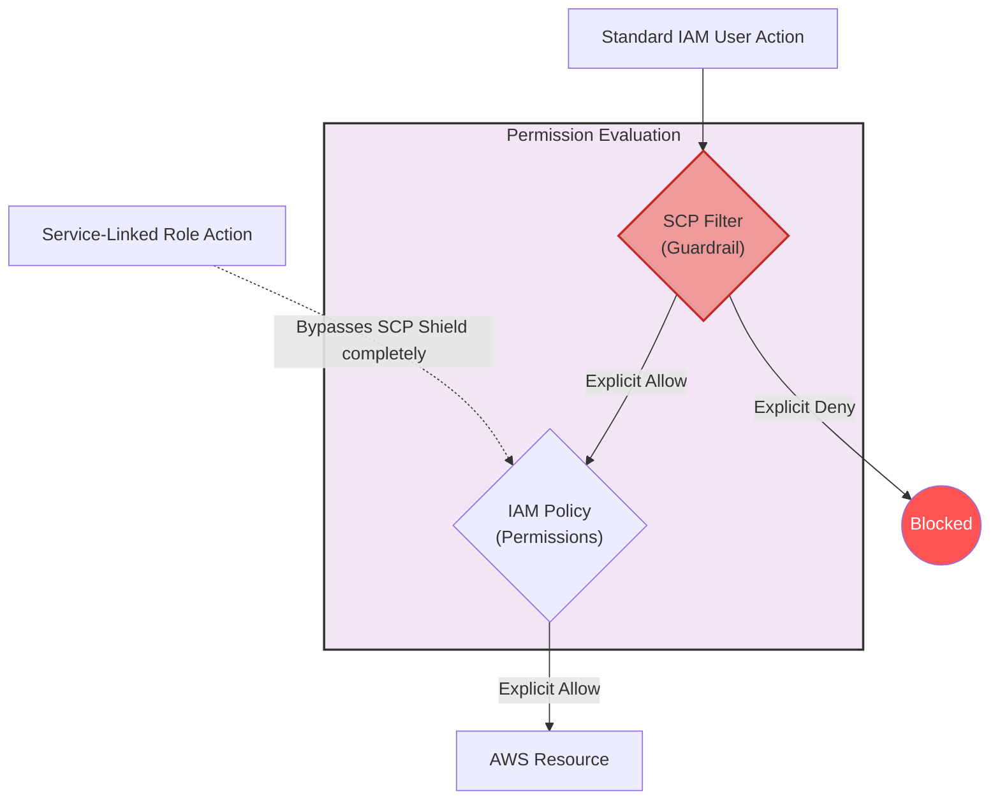
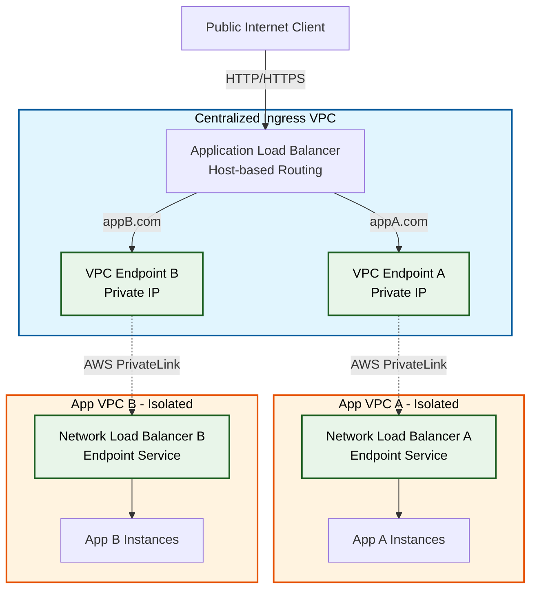
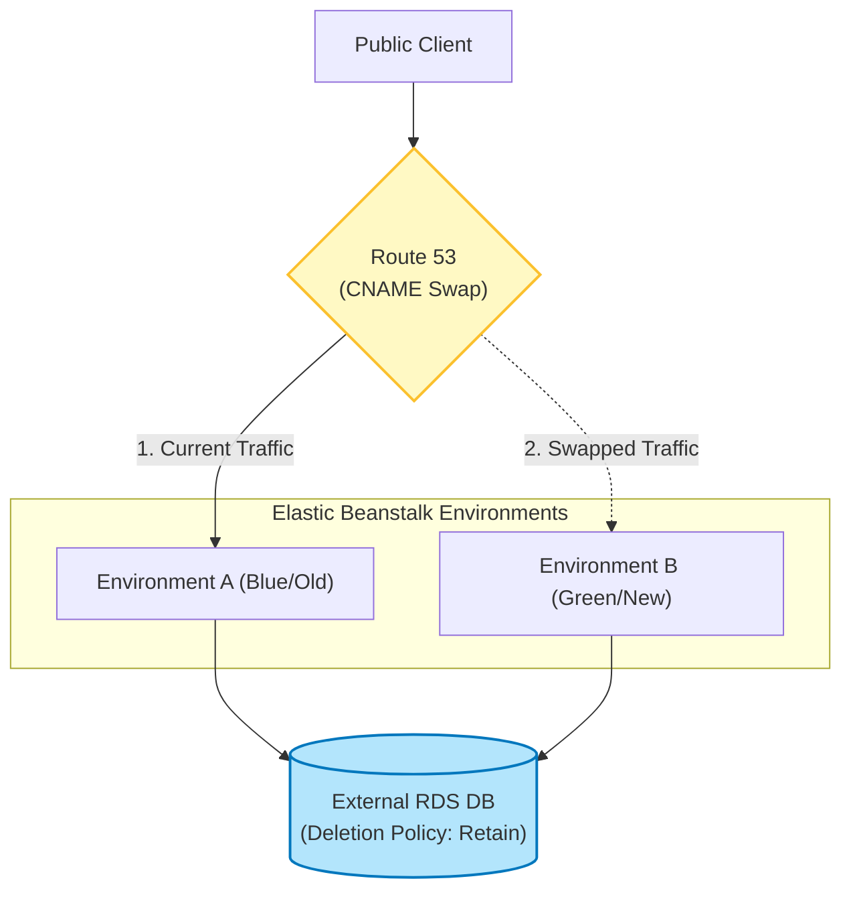

# AWS Architecture Exam Revision Notes

---

## 1. Cross-Account Access & Attribute-Based Access Control (ABAC)

**Scenario:** Restricting developers from one Business Unit (BU) from accidentally terminating another BU's EC2, EKS, or Aurora resources in a shared Production environment.

**The Architecture (Hub and Spoke):**

- **Hub:** Central Production Account
- **Spokes:** Individual BU Accounts grouped in Organizational Units (OUs)

**The Correct Solution:**

1. Create an IAM Role in the Production account.
2. Use a Trust Policy to only allow identities from specific OUs to assume the role (`sts:AssumeRole`).
3. Use Resource-Level Permissions (Tags) in the IAM policy — e.g., allow `ec2:TerminateInstances` only if the resource's `OwnerBU` tag matches the developer's BU.

**Key Takeaway:** Do not put production resources in individual developer accounts. Centralize them and use cross-account roles with tag-based conditions to enforce strict boundaries.

**Visual Architecture:**

---

## 2. AWS Resource Access Manager (RAM) & Organizations

**Scenario:** Sharing specified AWS resources centrally across an AWS Organization without manually configuring each account.

**The Core Concept:** Use AWS RAM to share resources seamlessly across all accounts.

**The Correct Solution:**

- Enable **Trusted Access** in AWS RAM.
- CLI Command: `enable-sharing-with-aws-organizations`
- How it works: Automatically creates an IAM Service-Linked Role (`AWSResourceAccessManagerServiceRolePolicy`) in every account. It does **not** affect existing IAM users or roles.

**Exam Traps:**

- Do **not** use Systems Manager (SSM) for this; SSM is for OS-level VM automation.
- You cannot modify the trust policy of a Service-Linked Role manually.
- The feature is specifically called **"Trusted Access"**, not "Cross-Account Access" in the RAM console.

**Visual Architecture:**

---

## 3. Inter-Region VPC Access via AWS Direct Connect

**Scenario:** Connecting an on-premises data center to multiple VPCs across different AWS Regions securely and with predictable performance.

**The Core Concept:** Dedicated, private, predictable connection (AWS Direct Connect).

**The Architecture:**

> On-Prem → Private VIF → Direct Connect Gateway (DXGW) → Virtual Private Gateway (VGW) → Multi-Region VPCs

**The Correct Solution:**

1. Use a **Direct Connect Gateway** for inter-region VPC access.
2. Create a **Virtual Private Gateway** in each VPC.
3. Create a **Private Virtual Interface (Private VIF)**.

**Exam Traps:**

- **Public VIFs** are for public services (S3/DynamoDB), **not** private VPCs.
- **LAG (Link Aggregation Group)** is just for combining physical ports for bandwidth, not multi-region routing.
- **Transit Gateway + VPN** travels over the public internet (not dedicated/predictable).
- **Inter-Region VPC Peering** does not connect on-premises data centers to AWS.

**Visual Architecture:**

---

## 4. Service Control Policies (SCPs) vs. IAM Policies

**Scenario:** Filtering permissions across an AWS Organization and understanding how SCPs interact with Service-Linked Roles.

**The Core Concept:** SCPs act as a **maximum permission guardrail**. To perform an action, a user needs an explicit Allow in their IAM policy **AND** an Allow in the applicable SCPs.

**The Golden Rules:**

| Rule | Description |
|---|---|
| Explicit Deny Wins | A Deny in an SCP overrides everything |
| Implicit Deny | If an action isn't explicitly allowed by an SCP, it is blocked |
| The SCP Shield | SCPs **do not** affect Service-Linked Roles — they are immune |

**Exam Traps:**

- Don't modify the default `FullAWSAccess` SCP; attach a new Deny SCP alongside it.
- An Allow at a higher OU does **not** override a Deny at a lower OU. A Deny at any level blocks the action.

**Visual Architecture:**

---

## 5. Centralized Ingress (ALB + PrivateLink + NLB)

**Scenario:** Routing internet traffic based on HTTP Host Headers to different applications hosted in completely isolated, separate VPCs.

**The Core Concept:** Layer 7 routing (Host-Based) at the edge, securely crossing VPC boundaries without peering.

**The Architecture:**

> Public Internet → Central Public ALB → VPC Endpoints → AWS PrivateLink → Private NLB → App Instances

**The Correct Solution:**

1. Set up a **public ALB** in a centralized VPC to perform Host-Based Routing.
2. Point ALB target groups to the **private IP addresses of VPC Endpoints**.
3. Connect VPC Endpoints via **AWS PrivateLink** to a private NLB in each isolated app VPC.

**Exam Traps:**

- **VPC Peering** violates the strict security isolation requirement.
- A **public NLB** at the front is wrong — NLB operates at Layer 4 and cannot read HTTP Host headers for routing.

**Visual Architecture:**

---

## 6. Elastic Beanstalk: Blue/Green Deployment with Decoupled RDS

**Scenario:** Upgrading an Elastic Beanstalk application without downtime or data loss when the RDS database is currently coupled to the environment.

**The Core Concept:** Tying a production database to a Beanstalk environment's lifecycle is dangerous. Decouple it to make it independent before doing a Blue/Green deployment.

**The Correct Solution:**

1. **Decouple:** Change the Beanstalk DB deletion policy to `Retain`, then decouple the RDS instance.
2. **Clone:** Launch a new Beanstalk environment (Green) and configure it to connect to the external RDS instance.
3. **Swap:** Swap the CNAMEs of the two environments to redirect traffic instantly with zero downtime.

**Exam Traps:**

- Doing an **In-Place Update** causes application downtime and risks the database.
- Using the **Snapshot** or **Delete** policy instead of `Retain` will result in the live database being terminated.

**Visual Architecture:**

